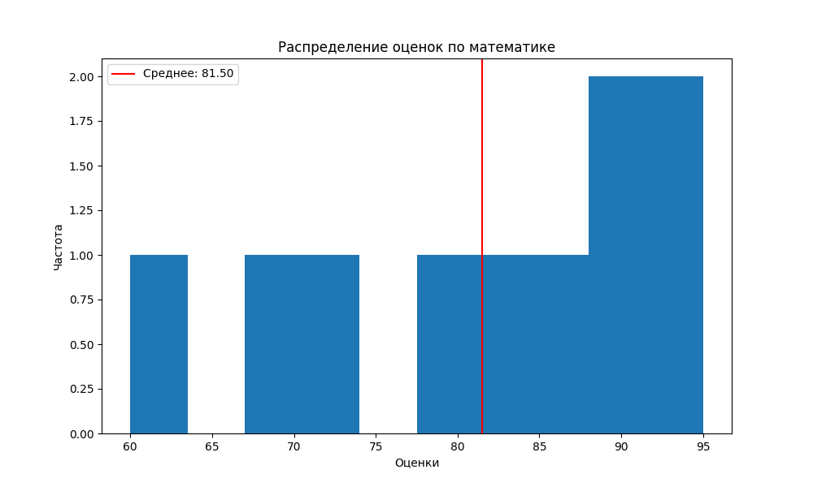
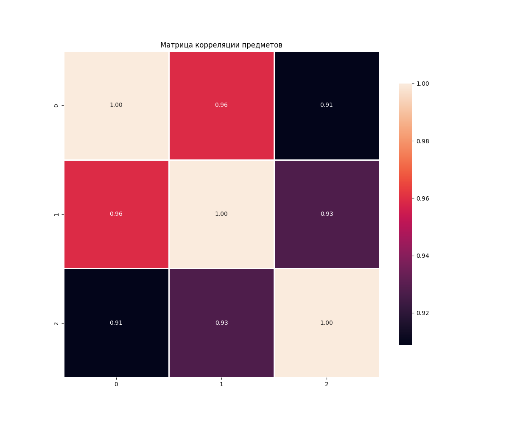
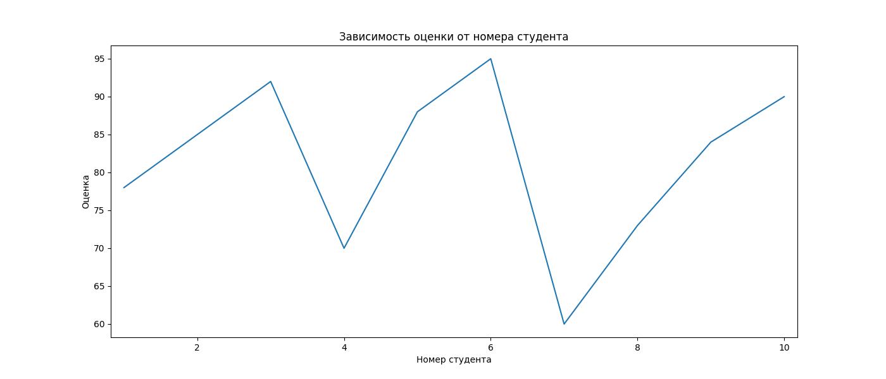

# Лабораторная работа 2
## Тема: Основы NumPy: массивы и векторные операции

---

## 1. Цель работы
Научиться использовать библиотеку NumPy для численных вычислений, статистического анализа и визуализации данных.

---

## 2. Описание задачи
Реализовать набор функций для численных вычислений с NumPy на основе данных об успеваемости студентов.

### Данные: CSV-файл с оценками 10 студентов по математике, физике и информатике.

### Необходимо реализовать:

* Создание и преобразование массивов
* Векторные и матричные операции
* Статистический анализ (среднее, медиана, std, перцентили)
* Нормализацию данных
* Визуализацию (гистограммы, тепловая карта, линейные графики)

### Требования: прохождение 17 тестов, PEP-8, docstring, обработка ошибок.

---

## 3. Ход выполнения

## 3.1 Подготовка окружения
```commandline
# Создание виртуального окружения
python -m venv numpy_env

# Активация (Windows)
numpy_env\Scripts\activate

# Установка библиотек
pip install numpy matplotlib seaborn pandas pytest
```

## 3.2 Создание структуры проекта
```
numpy_lab/
├── main.py          # Основной код
├── test.py          # Тесты
├── data/            # Папка с данными
│   └── students_scores.csv
└── plots/           # Папка для графиков
```

## 3.3 Реализация функций

### Создание и обработка массивов
```py
def create_vector():
    return np.arange(10)

def create_matrix():
    return np.random.rand(5, 5)

def reshape_vector(vec):
    return vec.reshape(2, 5)

def transpose_matrix(mat):
    return mat.T
```

### Векторные операции
```py
def vector_add(a, b):
    return a + b

def scalar_multiply(vec, scalar):
    return vec * scalar

def dot_product(a, b):
    return np.dot(a, b)
```

### Матричные операции
```py
def matrix_multiply(a, b):
    return a @ b

def matrix_determinant(a):
    return np.linalg.det(a)

def matrix_inverse(a):
    return np.linalg.inv(a)

def solve_linear_system(a, b):
    return np.linalg.solve(a, b)
```

### Статистический анализ
```py
def load_dataset(path):
    return pd.read_csv(path).to_numpy()

def statistical_analysis(data):
    return {
        'mean': np.mean(data),
        'median': np.median(data),
        'std': np.std(data),
        'min': np.min(data),
        'max': np.max(data),
        '25_percentile': np.percentile(data, 25),
        '75_percentile': np.percentile(data, 75)
    }

def normalize_data(data):
    return (data - np.min(data)) / (np.max(data) - np.min(data))
```

### Визуализация
```py
def plot_histogram(data):
    plt.figure()
    plt.hist(data, bins=10)
    plt.title("Гистограмма оценок")
    plt.savefig('plots/math_scores_histogram.png')
    plt.close()

def plot_heatmap(matrix):
    plt.figure()
    sns.heatmap(matrix, annot=True)
    plt.title("Корреляция предметов")
    plt.savefig('plots/correlation_heatmap.png')
    plt.close()

def plot_line(x, y):
    plt.figure()
    plt.plot(x, y)
    plt.title("Оценки студентов")
    plt.savefig('plots/student_scores.png')
    plt.close()
```

## 3.4 Тестирование
```commandline
python3 -m pytest test.py -v
```

---

## 4. Трудности в ходе выполнения

### 4.1 Проблемы с размерностями массивов
При выполнении операций сложения, умножения и скалярного произведения возникали ошибки из-за несовпадения размерностей массивов.

Решение:
```py
if a.shape != b.shape:
    raise ValueError(f"Векторы должны быть одинаковой формы: {a.shape} vs {b.shape}")
```

### 4.2 Вырожденные матрицы
При попытке найти обратную матрицу для вырожденной матрицы (определитель = 0) возникала ошибка

Решение:
```py
det = np.linalg.det(a)
    if np.abs(det) < 1e-10:
        raise ValueError(f"Матрица вырождена (определитель = {det:.2e}). Обратной матрицы не существует.")
```

### 4.3 Неквадратные матрицы
Функции matrix_determinant() и matrix_inverse() вызывались для неквадратных матриц.

Решение:
```py
if a.shape[0] != a.shape[1]:
    raise ValueError(f"Матрица должна быть квадратной, получена форма {a.shape}")
```

### 4.4 Деление на ноль при нормализации
Если все значения в массиве одинаковые, то max - min = 0, что приводит к делению на ноль.

Решение:
```py
if np.abs(max_val - min_val) < 1e-10:
    raise ValueError(f"Невозможно нормализовать: все значения одинаковы")
```

### 4.5 Пустые массивы
Функции статистического анализа вызывались для пустых массивов.

Решение:
```py
if data.size == 0:
    raise ValueError("Массив данных пустой")
```

### 4.6 Несовместимые матрицы для умножения
Умножение матриц требует, чтобы количество столбцов первой матрицы равнялось количеству строк второй.
 
Решение:
```py
if a.shape[1] != b.shape[0]:
    raise ValueError(f"Несовместимые размерности для умножения: {a.shape} и {b.shape}")
```

---

## 5. Выводы

* Освоены базовые операции NumPy с массивами

* Освоена работы с матричными вычислениями

* Освоена работа с графиками и их построением с помощью matplotlib и seaborn

---

## 6. Графики

### Гистограмма распределения оценок по математике



### Тепловая карта корреляции предметов



### График зависимости оценок по математике



---

## 7. Тесты

